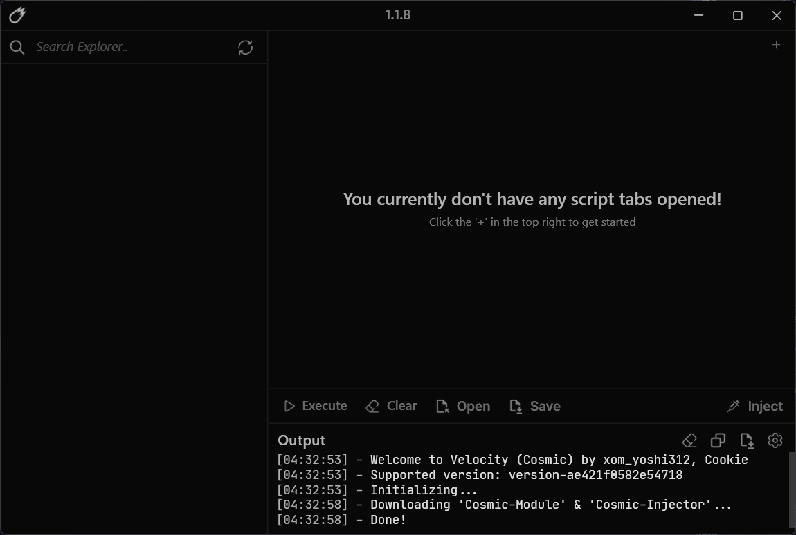
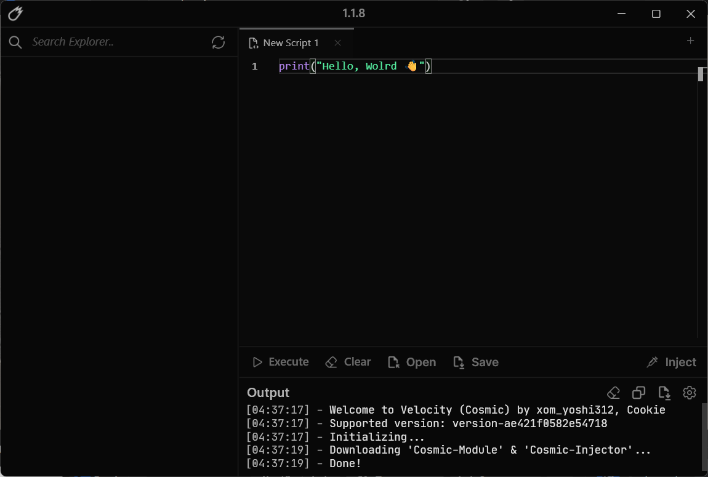
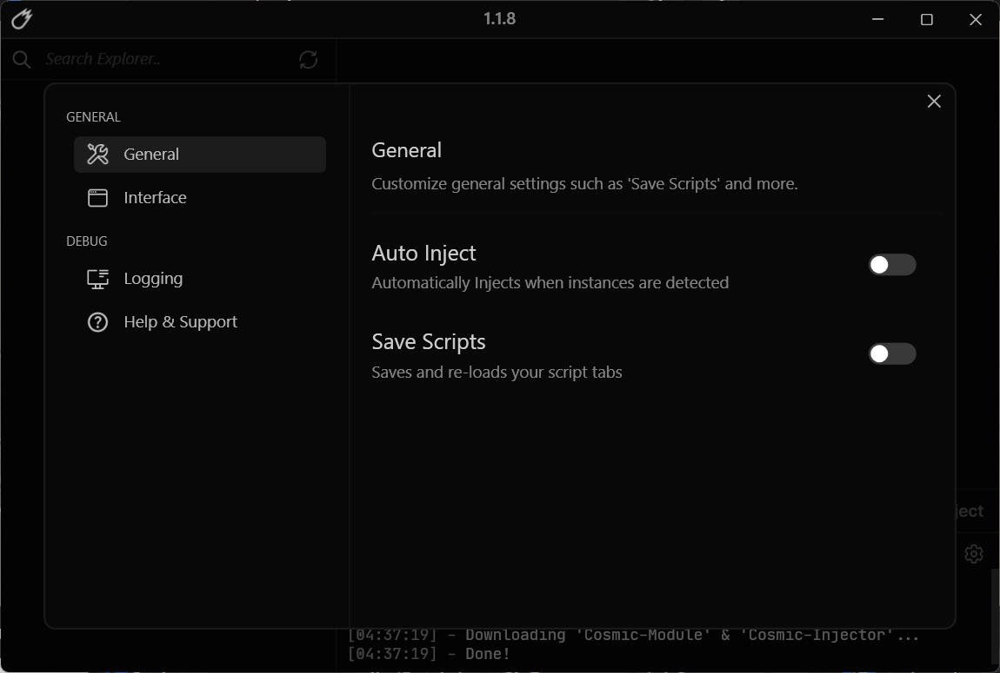
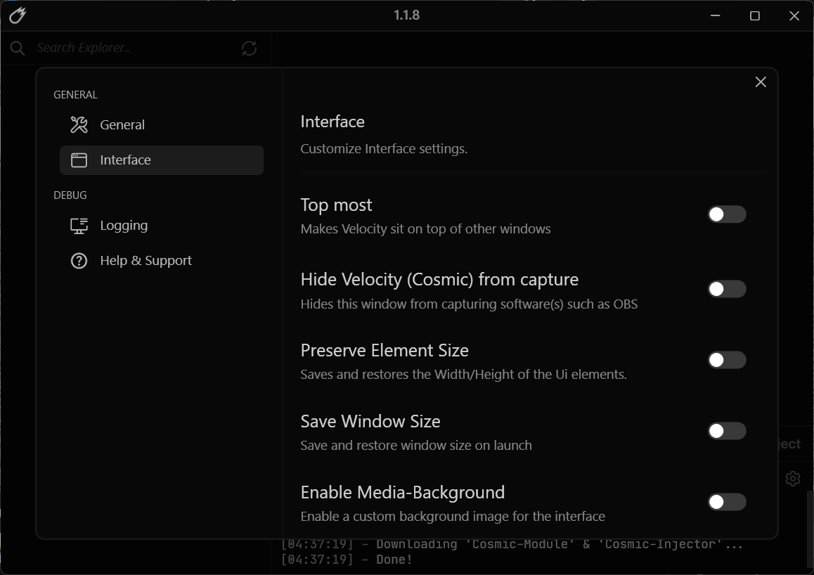
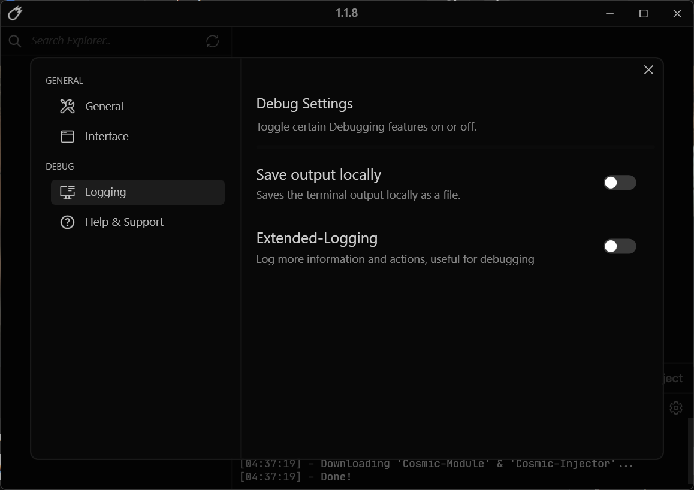
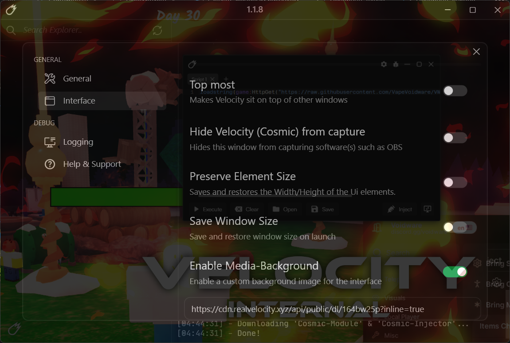

# VelocityCosmic

**Looking for an alternative to the original Cosmic Synapse interface?**

VelocityCosmic offers a more user-friendly experience powered by the **Velocity UI**, featuring a modern and more attractive design compared to the standard Synapse interface.

The project is **fully open-source** and boasts a sleek, contemporary aesthetic. Feel free to fork the repository, customize the features, and enhance the code to suit your specific needs!

> [!IMPORTANT]
> **VelocityCosmic** is a Custom UI using the **Velocity UI** and the **Cosmic API**. 
> 
> * **This is NOT a free version of Cosmic:** Authentication required. You will need a valid Cosmic account and subscription to log in and use features (**All authentication and subscription checks are performed by Cosmic**).

> [!WARNING]
> This project is under active development. Expect bugs, missing features, and potential breaking changes.
---

## Overview

VelocityCosmic is **completely open-source** and features a clean, modern design. It offers a wide range of great features

## Features

- **Cosmic API:** Good, fast, lots of features
- **Advanced Editor Script:** Tabs, Syntax Highlighting, Advanced Autocomplete, 
- **Customizable Settings:** Top-Most, Save Scripts, Hide VelocityCosmic from capture.
  - **Enable Media-Background:** Enable a custom background image for the interface.
  - **Hide VelocityCosmic from capture:** Hides this window from capturing software(s) such as OBS.
  - **Save Scripts:** Saves and re-loads your script tabs.

## Screenshots

| Start | Editor |
| :---: | :---: |
|  |  |

| Settings: General | Settings: Interface | Settings: Debug & Logging |
| :---: | :---: | :---: |
|  |  |  |

| Custom Background (Media-Background) |
| :---: |
|  |

## Requirements

- **OS:** Windows 10/11 (x64)
- **[.NET 8 Runtime](https://builds.dotnet.microsoft.com/dotnet/Runtime/8.0.25/dotnet-runtime-8.0.25-win-x64.exe)**
- **[Microsoft Edge WebView2 Runtime](https://developer.microsoft.com/microsoft-edge/webview2/)**

## Installation

1. Install both runtimes listed above if they are not already on your system.
2. Download the latest build from the [Releases](../../releases).
3. Extract the archive and run `VelocityCosmic.exe`.

## Official links to Cosmic
- **[Discord Server](https://discord.gg/getcosmic)**
- **[Website](https://cosmic.best)**
